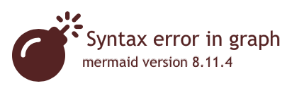

# mkdocs-mermaid2-plugin

[](https://opensource.org/licenses/MIT)

An [MkDocs](https://www.mkdocs.org/) plugin that renders textual graph descriptions into
[Mermaid](https://mermaid-js.github.io/mermaid) graphs (flow charts, sequence diagrams, pie charts, etc.).

> This is a fork from [Laurent Franceschetti's excellent project](https://github.com/fralau/mkdocs-mermaid2-plugin),
> which in turn picked up where a prior project left off. This verion is cut down to serve the more limited needs of
> the OUH [mkdocs-material][ouhft-material] theme, which more tightly integrates components for secure local hosting.

<!-- toc -->
-   [How it works](#how-it-works)
-   [Installation](#installation)
-   [Configuration](#configuration)
-   [Usage](#usage)
-   [Tips and Tricks](#tips-and-tricks)
-   [Troubleshooting: the mermaid diagram is not being displayed](#troubleshooting-the-mermaid-diagram-is-not-being-displayed)
-   [Using the mermaid2.dumps() function](#using-the-mermaid2dumps-function)
<!-- tocstop -->

## How it works

**If you do not wish to learn the details under the hood, skip to the [Installation](#installation) section**.

Normally mkdocs inserts the Mermaid code (text) describing the diagram into segments `<pre><code class='mermaid>`:

``` html
<pre><div class="mermaid">
...
</div></pre>
```

To make the HTML/css page more robust, the mermaid plugin converts those segments into `<div>` elements in the final
HTML page:

``` html
<div class="mermaid">
...
</div>
```

It also inserts a call to the [javascript library](https://github.com/mermaid-js/mermaid) :

``` html
<script>
mermaid.initialize(...)
</script>
```

The Mermaid library is included as part of the [OUH Material theme][ouhft-material].

The user's browser will then read this code and render it on the fly.

> No svg/png images were harmed during the rendering of that graph.

## Installation

TBC - this is handled by the [OUH Material theme][ouhft-material]

## Configuration

### Basic configuration

To enable this plugin, you need to declare it in your config file (`mkdocs.yml`).

In order to work, the plugin also requires the [mermaid](https://www.npmjs.com/package/mermaid) javascript library (in our use case, this is already part of the [OUH Material theme][ouhft-material] build process).

``` yaml
plugins:
  - search
  - mermaid2
```

> **Note:**  If you declare plugins, you need to declare _all_ of them, including `search` (which would otherwise have
> been installed by default.)

By design, the theme build selects a version of the Mermaid javascript library that is known to work (some versions work
better than others).

## Usage

### General Principle

In order to insert a Mermaid diagram in a markdown page, simply type it using the mermaid syntax, and surround it with
the code fence for Mermaid:

``` markdown
    ``` mermaid
    graph TD
    A[Client] --> B[Load Balancer]
    B --> C[Server01]
    B --> D[Server02]
    ```
```

### How to write Mermaid diagrams

-   For instructions on how to make a diagram, see [the official website](https://mermaid-js.github.io/mermaid/#/).
-   If you are not familiar, see the [n00bs' introduction to mermaid](https://mermaid-js.github.io/mermaid/#/n00b-overview).
-   In case of doubt, you will want to test your diagrams in the [Mermaid Live Editor](https://mermaid-js.github.io/mermaid-live-editor).

### Adding arguments to the Mermaid engine

By default, the plugin automatically inserts the a Javascript command `mermaid.initialize();` in the HTML pages, which
starts the interpretation. Sometimes, however, you may want to add some initialization commands (see
[full list](https://github.com/knsv/mermaid/blob/master/docs/mermaidAPI.md#mermaidapi-configuration-defaults)).

For example, you could change the theme of the diagram, using 'dark' instead of the default one. Simply add those
arguments in the config file, e.g.

``` yaml
plugins:
  - search
  - mermaid2:
    arguments:
      theme: 'dark'
```

### Testing

To test your website with a diagram, restart the mkdocs server:

``` bash
mkdocs serve
```

In your browser, open the webpage on the localhost (by default: `https://localhost:8000`)

### Adding a Javascript callback function

_New in 0.3.0_

#### Use Case

To make modifications that are not possible with css, it can be useful to insert a callback function (Javascript) into
the target HTML page.

This can be done using the standard pattern, e.g.:

``` javascript
<script src="js/extra.js">
<script>mermaid.initialize({
    theme: "dark",
    mermaid: {
        callback: myMermaidCallbackFunction
    }
});</script>
```

In this case, `myMermaidCallbackFunction`is located in the `js/extra.js` on the site's root directory.

Here is a simplistic example:

``` javascript
// js/extra.js
function myMermaidCallbackFunction(id) {
  console.log('myMermaidCallbackFunction', id);
```

> You will see the results if you display the browser's console.

#### Method

This can be translated into the config (`mkdocs.yaml`) file as:

``` yaml
plugins:
  - mermaid2:
      arguments:
        theme: dark
        mermaid:
            callback: ^myMermaidCallbackFunction

extra_javascript:
  - js/extra.js
```

1.  Note that **the name of the function must be preceded by a ^ (caret)** to signify it's a literal and not a string.
2.  Consider the **directory path** for the script as **relative to the document directory** (`docs`). Mkdocs will then
    put it in the proper place in the hierarchy of the html pages.

## Tips and Tricks

### Setting the security level to "loose"

To access these functions, you need to relax mermaid's security level,
([since version 8.2](https://mermaid-js.github.io/mermaid/#/?id=special-note-regarding-version-82)).

> This requires, of course, your application taking responsibility for the security of the diagram source.

If that is OK with you, you can set the argument in the configuration of the
plugin:

``` yaml
- mermaid2:
    arguments:
      securityLevel: 'loose'
```

## Troubleshooting: the mermaid diagram is not being displayed

> To start with, use a simple diagram that you know is syntactically correct.

e.g.

``` markdown
    ``` mermaid
    graph TD
    A[Client] --> B[Load Balancer]
    B --> C[Server01]
    B --> D[Server02]
    ```
```

### Seeing an error message at the place of the diagram?

In recent versions of the javascript library (> 8.6.0), a pretty error message is displayed in case of incorrect syntax:



> **In earlier versions, the library displays nothing, which can be confusing.**

If you see the error message, it is at least an indication that the mermaid javascript library was called.

### The mermaid source code appears as-is (not read)?

In that case, the javascript library was probably not called. See the next questions.

### Is the javascript library properly called?

In order to work, the proper javascript library must called from the html page.

Every diagram should start with a valid preamble, e.g. `graph TD`.

In case of doubt, you may want to test your diagram in the
[Mermaid Live Editor](https://mermaid-js.github.io/mermaid-live-editor).

> Note, however, that the Mermaid Live Editor **does not support loose mode** (with HTML code in the mermaid code).

### Rich text diagrams, or links are not displayed properly?

1.  As a first step, [set the security level to 'loose'](#setting-the-security-level-to-loose).
2.  Make sure you use a compatible version of the javascript library

## Using the mermaid2.dumps() function

As a bonus, mermaid2 exports the function `dumps()` which produces a string describing a [JavaScript object](https://javascript.info/object). It can be used to help generate JavaScript code from Python (this is typically needed, when generating an HTML page that contains JavaScript).

A JavaScript object is not exactly the same as a JSON object. The reason why this why introduced is that sometimes one needs to produce a key/value pair as:

``` javascript
foo = MyFunctioName
```

where the value is _not_ a string but an identifier (in this case: a function name).

Here is an example:

``` python
import mermaid2

obj = { "hello": "world", 
    "barbaz": "^bazbar",
    "foo": {"bar": 2},
    "bar": True}

s = mermaid2.dumps(obj)

```

The purpose of the caret is to specify that the value should be an identifier and not a string. The result will be:

``` javascript
{
    hello: "world",
    barbaz: bazbar,
    foo: {
        bar: 2
    },
    bar: true
}
```

<!-- Link References -->
[ouhft-material]: https://github.com/ouhft/mkdocs-material
